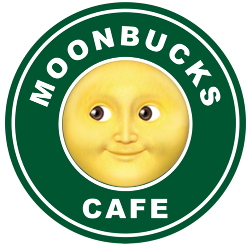

# JS 문벅스 카페메뉴 앱
<br/>
<p align="middle">
  
</p>


<br/>

## 프로젝트 소개
`VanillaJS` 로 구현 하는 상태관리가 가능한 카페메뉴 앱
- [x] 메뉴 카테고리를 구현할 수 있다.
- [x] api를 받아와 메뉴를 추가 / 수정 / 삭제 / 품절 관리를 할 수 있다.
- [x] 총 메뉴 개수에 대한 카운트 기능을 구현할 수 있다.

## 기술스택
- html
- css
- javascript

## 링크
- [Live site](https://moonbucks-menu.netlify.app)

## 📂 디렉토리 구조 

```

├── src
│   ├── css
│     └── index.css
│   ├── images
│   ├── js
│     ├── api
│       └── index.js
│     ├── utils
│       └── dom.js
└── index.html
```
